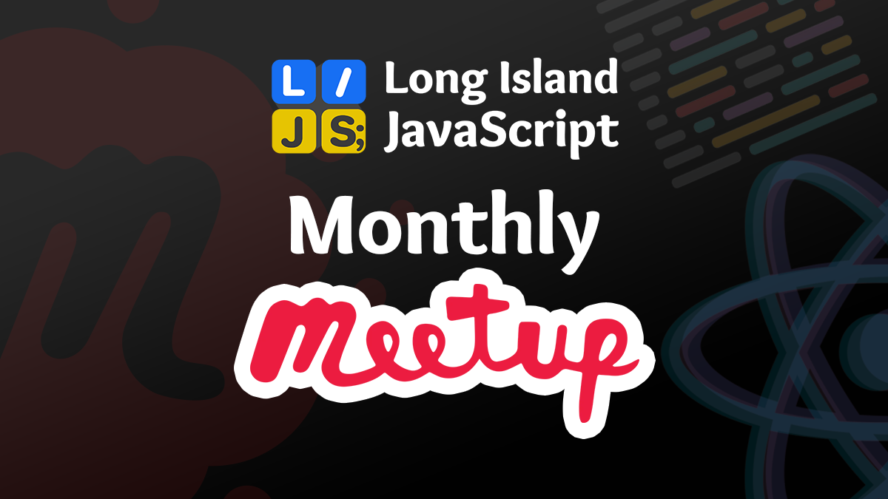

# Meetup Event: <MONTH YYYY>
### <Event Title>

[View Event on Meetup](<ADD_URL_HERE>)

This repo contains the resources for this event.

___

### ABOUT OUR GROUP:

Long Island JavaScript is a Meetup group in the Long Island, NY area. We meet on the last Wednesday of each month to discuss and learn about a range of topics and technologies around the JavaScript ecosystem. All skill levels are welcome. Visit our [Meetup page](https://www.meetup.com/long-island-javascript/) to join the group and RSVP for our next event.

🔗 https://www.meetup.com/long-island-javascript/

🔗 https://www.lijs.org

___
### FOR ORGANIZERS:

This template is used to create a new repo for each of our Meetup events that provide resources such as source code or slides.

Directions:
1. Click the green "Use this template" button above. 
2. Name the repo using the following format: `meetup-event-MM-YYYY`. For example: `meetup-event-05-2023`. 
3. Make sure to set the repo to public and click the "Include all branches" checkbox. 
4. Update the `README.md` file with the event details denoted with angle brackets.
5. Add the event graphic to the root of the repo using the following format: `event-graphic.png`.
6. Add any applicable code to the `code` folder.
7. Add any applicable slides or other resources to the root of the repo.
8. Delete this section of the README and commit your changes to the main branch.
